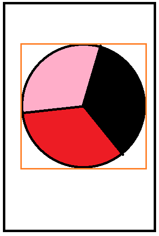
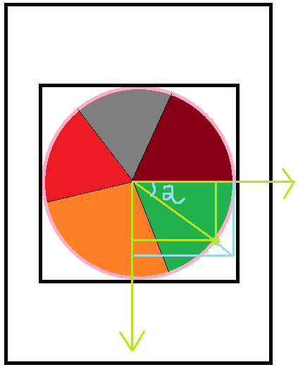
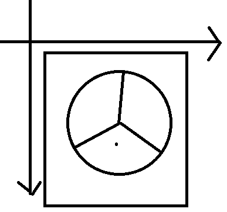

# 自定义控件之饼状图


## 绘制饼状图分析

1. 定义一个起始角度
2. 计算每块扇形的弧度
3. 遍历数据，每一个起始角度，是上一个扇形的结束角度
4. 扇形的外接矩形的左上右下不需要计算，移动坐标系到屏幕中间



## 绘制直线

直线的两个要素：

1. 直线的起点，这里是每块扇形的弧的中心点
2. 直线的终点，这里是连接圆心和起点的延长线上某个点

起点的计算：
1. 获取对应扇形的弧度
2. 扇形起始角度+弧度/2
3. 半径*角度结果的余弦值，横坐标纵坐标同理

终点的计算：起点计算的第三步将半径增大即可



```
//绘制直线
//Math.toRadians(参数):指的是将参数的弧度转换为角度
float startX = (float) (radius * Math.cos(Math.toRadians(startAngle + sweepAngle / 2)));
float startY = (float) (radius * Math.sin(Math.toRadians(startAngle + sweepAngle / 2)));
float endX = (float) ((radius + 30) * Math.cos(Math.toRadians(startAngle + sweepAngle / 2)));
float endY = (float) ((radius + 30) * Math.sin(Math.toRadians(startAngle + sweepAngle / 2)));
canvas.drawLine(startX, startY, endX, endY, linePaint);
```


## 判断点击位置所在的扇形区域



将点击的坐标位置转化为以饼状图中心为原点的坐标，对坐标进行处理，将坐标转化为点击的角度，判断是否处于某一个饼状图所在的角度区域

```java
public class MathUtil {
	public static float getTouchAngle(float x, float y) {
		float touchAngle = 0;
		if (x < 0 && y < 0) {  //2 象限
			touchAngle += 180;
		} else if (y < 0 && x > 0) {  //1象限
			touchAngle += 360;
		} else if (y > 0 && x < 0) {  //3象限
			touchAngle += 180;
		}
		//Math.atan(y/x) 返回正数值表示相对于 x 轴的逆时针转角，返回负数值则表示顺时针转角。
		//返回值乘以 180/π，将弧度转换为角度。
		touchAngle += Math.toDegrees(Math.atan(y / x));
		if (touchAngle < 0) {
			touchAngle = touchAngle + 360;
		}
		return touchAngle;
	}
}
```

处理触摸事件

```
//当用户与手机屏幕进行交互的时候(触摸)
	//触摸事件处理
	//1,按下去
	//2,移动
	//3,抬起
	//参数:触摸事件,这个事件是由用户与屏幕交互产生的,这个事件包含上述三种情况
	@Override
	public boolean onTouchEvent(MotionEvent event) {
		//获取用户对屏幕的行为
		int action = event.getAction();
		switch (action) {
			case MotionEvent.ACTION_DOWN:
				//做点击范围的认定
				//获取用户点击的位置距当前视图的左边缘的距离
				float x = event.getX();
				float y = event.getY();
				//将点击的x和y坐标转换为以饼状图为圆心的坐标
				x = x - width / 2;
				y = y - height / 2;
				float touchAngle = MathUtil.getTouchAngle(x, y);
				float touchRadius = (float) Math.sqrt(x * x + y * y);
				//判断触摸的点距离饼状图圆心的距离<饼状图对应圆的圆心
				if (touchRadius < radius) {
					//说明是一个有效点击区域
					//查找触摸的角度是否位于起始角度集合中
					//binarySearch:参数2在参数1对应的集合中的索引
					//未找到,则返回 -(和搜索的值附近的大于搜索值的正确值对应的索引值+1)
					//{1,2,3}
					//搜索1:返回值1在集合中对应的索引0
					//1.2:返回值为 -(1+1) -2
					//1.8:返回值 -(1+1) -2
					int searchResult = Arrays.binarySearch(startAngles, touchAngle);
					if (searchResult < 0) {
						position = -searchResult - 1 - 1;
					} else {
						position = searchResult;
					}
					Log.i("test", "position:" + position);
					//让onDraw方法重新调用:
					//重绘
					invalidate();
				}
				break;
			case MotionEvent.ACTION_MOVE:

				break;
			case MotionEvent.ACTION_UP:

				break;
		}
		return super.onTouchEvent(event);
	}
```

## 定义基本信息载体，即javabean

```java
public class PieEntity {
	//对应数据占用的份额
	public float value;
	//对应数据的颜色
	public int color;

	public PieEntity(float value, int color) {
		this.value = value;
		this.color = color;
	}
}

private int[] colors = {0xFFCCFF00, 0xFF6495ED, 0xFFE32636, 0xFF800000, 0xFF808000, 0xFFFF8C69, 0xFF808080,0xFFE6B800, 0xFF7CFC00};
```

## 初始化三个画笔

```java
private void init() {
	rectF = new RectF();
	//初始化path
	path = new Path();
	//初始化画笔
	paint = new Paint();
	paint.setAntiAlias(true);
	//创建绘制直线对应的画笔
	linePaint = new Paint();
	linePaint.setColor(Color.BLACK);
	linePaint.setAntiAlias(true);
	linePaint.setStrokeWidth(3);
	linePaint.setTextSize(20);
	touchRectF = new RectF();
}
```

## 计算绘制饼状图的外接矩形的左上右下距离

```java
//当自定义控件的尺寸已经决定好的时候回调
//这个方法是在onMeasure方法执行后执行,最终的测量结果已经产生
@Override
protected void onSizeChanged(int w, int h, int oldw, int oldh) {
	super.onSizeChanged(w, h, oldw, oldh);
	//获得当前控件的宽高
	this.width = w;
	this.height = h;
	//为了防止绘制后超出屏幕区域,获取屏幕的宽高的较小值
	int min = Math.min(w, h);
	//获得饼状图的半径:宽度和高度的较小值/2*0.7
	radius = (int) (min * 0.7f / 2);
	//获取饼状图的内接矩形
	rectF.left = -radius;
	rectF.top = -radius;
	rectF.right = radius;
	rectF.bottom = radius;
	touchRectF.left = -radius - 15;
	touchRectF.top = -radius - 15;
	touchRectF.right = radius + 15;
	touchRectF.bottom = radius + 15;
}
```

## 绘制饼状图

```java
if (mDataList == null)
		return;
//保存画布
canvas.save();
//屏幕画布到屏幕中间
canvas.translate(mTotalWidth / 2, mTotalHeight / 2);
//绘制饼图的每块区域
drawPie(canvas);
//还原画布
canvas.restore();
//5,绘制饼状图的步骤:
//起始的角度
float startAngle = 0;
//遍历数据绘制饼状图
for (int i = 0; i < mDataList.size(); i++) {
	/************************①绘制扇形****************************/
	//每个扇形的角度:数据值占总数据值的百分比
	float sweepAngle = mDataList.get(i).getValue() / mTotalValue * 360 - 1;
	//移动到初始点
	mPath.moveTo(0, 0);
	//绘制某一块扇形
	mPath.arcTo(mRectF, startAngle, sweepAngle);
	//设置颜色
	mPaint.setColor(mDataList.get(i).getColor());
	//绘制路径
	canvas.drawPath(mPath, mPaint);
	//重置路径:为了下次再绘制不会和上一次重叠
	mPath.reset();
	/***************************②绘制指示线*******************************/
	//绘制线和文本
	//确定直线的起始和结束的点的位置
	float startLineX = (float) (mRadius * Math.cos(Math.toRadians(startAngle + sweepAngle / 2)));
	float startLineY = (float) (mRadius * Math.sin(Math.toRadians(startAngle + sweepAngle / 2)));
	float endLineX = (float) ((mRadius + 30) * Math.cos(Math.toRadians(startAngle + sweepAngle / 2)));
	float endLineY = (float) ((mRadius + 30) * Math.sin(Math.toRadians(startAngle + sweepAngle / 2)));
	canvas.drawLine(startLineX, startLineY, endLineX, endLineY, mLinePaint);
	//记录下一次的起始角度为之前所有绘制的扇形弧度+1
	startAngle += sweepAngle + 1;
	/***************************③绘制文本*******************************/
	float res = mDataList.get(i).getValue() / mTotalValue * 100;
	//格式化数据,小数点后保留1位有效数字
	String percent = String.format("%.1f", entities.get(i).value / totalValue * 100);
	//将弧度转化为角度
	float v = startAngle % 360;
	//判断如果起始角度>90度并且小于270度
	if (startAngle % 360.0 >= 90.0 && startAngle % 360.0 <= 270.0) {
		Log.i("test", "resToRound:" + resToRound);
		//将文本绘制到文本连接线终点的左边
		canvas.drawText(resToRound + "%", endLineX - mTextPaint.measureText(resToRound + "%"), endLineY, mTextPaint);
	} else {
		//将文本绘制到文本连接线终点所在位置
		canvas.drawText(resToRound + "%", endLineX, endLineY, mTextPaint);
	}
	/****************************************************************/
}
```